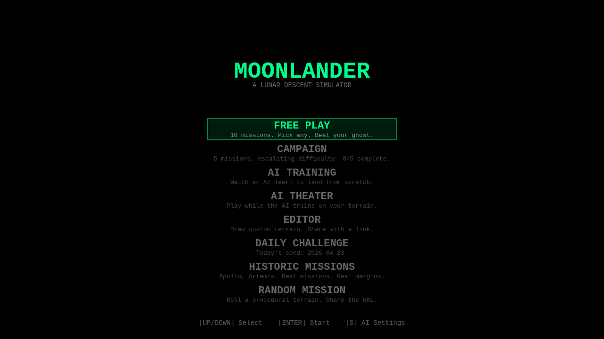
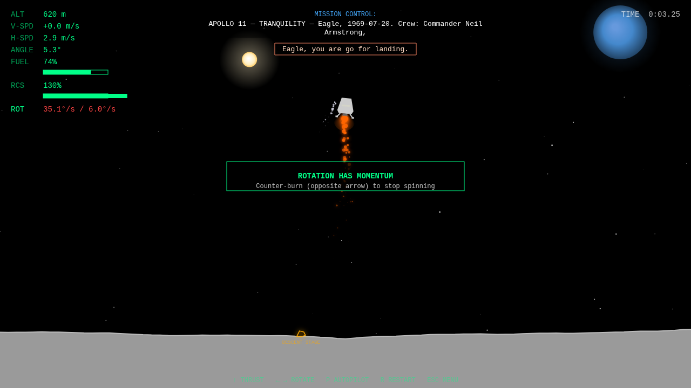
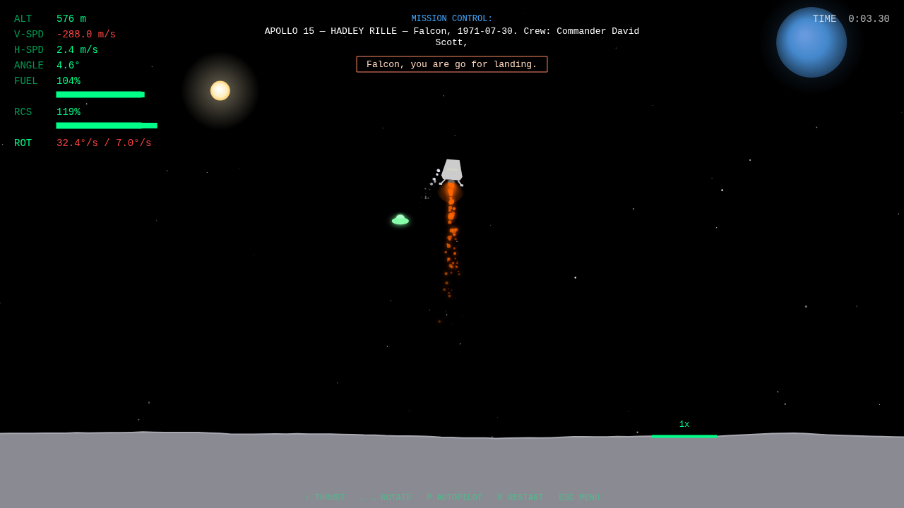
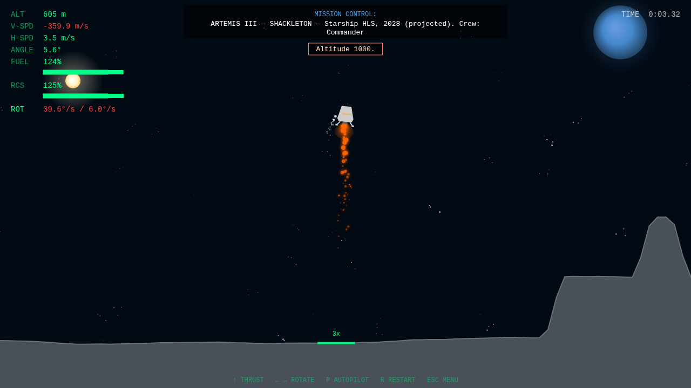

# MoonLander Enhanced

A browser-based, AI-enhanced reimagining of the 1979 Atari Moon Lander. Runs entirely in the browser. No install, no backend.

Current version: **v0.6.2.2** (see [`CHANGELOG.md`](./CHANGELOG.md)).



## What's interesting

- **Real lunar physics.** 1.62 m/s² gravity, rigid-body rotation (Sprint 7.2 Part 1), a separate RCS propellant tank for attitude control, and per-mission landing tolerances (Sprint 7.2 Part 2). Land too fast, too tilted, or still spinning and you crash — with the specific failure named ("SPINNING — STRUCTURAL FAILURE").
- **Procedural terrain + seeded runs.** Same seed = same terrain. Share a URL, race the same map.
- **Historic missions.** A playable lunar museum spanning 1966 to 2028. Luna 9 (Soviet first soft landing), Apollo 11 / 13 / 15 / 17 (landing + Apollo 13's non-landing "Survive" loop-around), and Artemis III. Each mission carries accurate fuel budgets, lander stats, and event-triggered radio chatter.
- **Authentic Mode.** Flip era-accurate tech on historic landings — Apollo 11's 1202 alarm, altitude blackout under 50 AGL, master-alarm cues, DSKY-amber HUD. Apollo era tightens the landing-rotation gate to 3-3.5°/s (matching real Apollo LM RCS deadband). Dual-track leaderboard keeps vanilla and authentic bests separate per mission.
- **AI Theater.** Watch a DQN learn to land in real time at 50x speed, compare DQN vs policy gradient vs random, then fork any episode and try to beat the AI from that exact frame.
- **Smarter DQN.** Prioritized experience replay, 11-dim state vector with vertical acceleration and ground proximity, quality-scaled terminal reward. Agent learns to land in ~15 episodes instead of 40-60.
- **Hazards.** Alien UFOs that siphon fuel or reverse controls. Gravity storms. Fuel leaks. Lunar archaeology objects with Apollo-era trivia.
- **Ghost replays, leaderboards, shareable flight reports.** All client-side via localStorage + IndexedDB.

## Missions

| Apollo 11 — Tranquility | Apollo 15 — Hadley Rille | Artemis III — Shackleton |
|:---:|:---:|:---:|
|  |  |  |
| Classic maria, stable site. Vanilla gate 6°/s. | Rille trench, J-mission tank, 7°/s gate. | South polar palette, Starship HLS, hazard-aware ellipse. |

The new HUD `ROT` readout (bottom of the stat column, white → amber → red as you approach the gate) makes SPINNING crashes visible before they happen.

## Run it locally

```bash
npm install
npm run dev
```

Opens at `http://localhost:5173`. No API keys needed for core gameplay. Optional Claude API key in Settings unlocks dynamic mission briefings and post-flight coaching tips (rule-based fallback runs offline).

## Controls

- **Arrow keys or WASD** — rotate left/right, thrust
- **Space** — thrust (alt)
- **P** — toggle rule-based autopilot
- **A** — toggle autopilot annotation overlay
- **V** — toggle retro vector skin (1979 Atari look)
- **?** — compact vs expanded UI

Under the v3 physics model, rotation carries momentum. Release a rotate key and the lander keeps spinning at its built-up angular velocity. Counter-burn to stop — this is what the RCS propellant tank is for. The `ROT` HUD readout shows current rate vs the per-mission landing gate.

## Project orientation

- **Code lives under `src/`** organized by concern: `game/`, `render/`, `ai/`, `systems/`, `api/`, `utils/`.
- **Full architecture + roadmap:** [`CLAUDE.md`](./CLAUDE.md) — the source of truth for project identity, tech stack, sprint plan, and gotchas.
- **Tests:** `npx vitest run` (431 tests). Types: `npx tsc --noEmit`. Lint: `npx biome check src/ tests/`.
- **Active plans:** [`.plans/`](./.plans/) — per-sprint plan files with CEO + Eng review reports.
- **Deferred work:** [`TODOS.md`](./TODOS.md).

## Status

Phases 1-3 shipped. Phase 4 (polish + shareability) mostly done. The "AI Theater First" long-term roadmap is mid-sprint. Sprint 5 Part A (Historic Missions foundations + Apollo landings + Artemis) shipped at v0.5.7.0. Sprint 2.7 (Smarter DQN) at v0.5.8.0. Sprint 2.6 (AI Theater Explain Mode) Parts A+B+C at v0.5.8.1–v0.5.8.3. Sprint 5.5 Part A (Authentic Mode) at v0.5.9.0. Sprint 5 Part B (Apollo 13 Survive + Luna 9 auto-landing) plus Sprint 5.5 polish at v0.5.9.1. Sprint 6 Part A (WebGL rendering pipeline + Canvas fallback) at v0.5.9.2. Sprint 6 Part B (scene-wide bloom, opt-in via `?renderer=webgl`) at v0.5.9.3. Sprint 6 Part C (per-mission sun in the skybox, bigger crash shake, impact flash) at v0.5.9.4. **v0.6.0.0 milestone** marks Sprint 6 complete (Parts A+B+C) plus a polish pass that removed dead scaffolding. Sprint 7.1 PR 1 (terrain palettes + archetypes + mission variety) at v0.6.0.1. Sprint 7.2 Part 1 (rigid-body physics + separate RCS tank + autopilot rewrite) at v0.6.1.0. Sprint 7.2 Part 2 (per-mission RCS + landing-rate tuning + HUD angular-rate readout) at v0.6.2.0. Luna 9 autopilot mitigation (unlock `[P]` + default OFF on auto-landing) at v0.6.2.1-v0.6.2.2. Next up: Sprint 7.3 (engine gimbal + center-of-mass shift) or WebRTC peer-to-peer multiplayer.

## License

MIT — see `LICENSE` if present, otherwise assume MIT.
